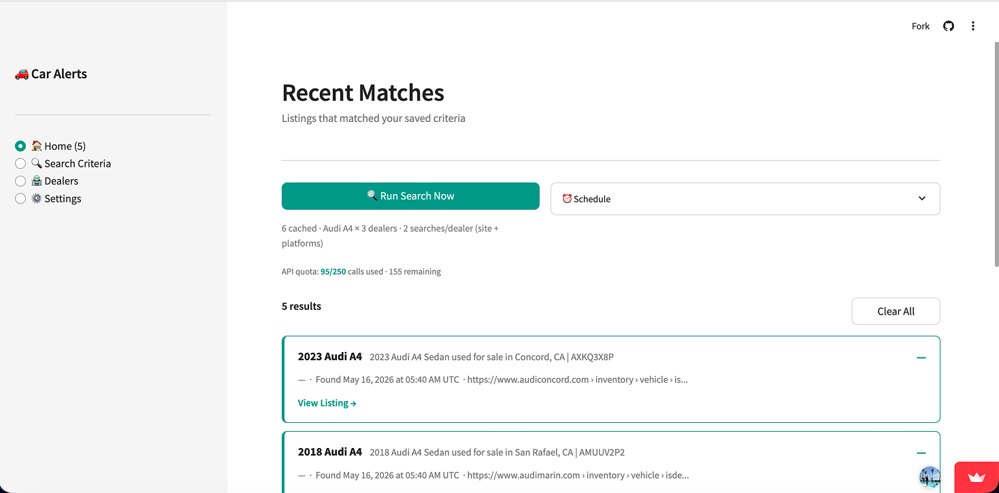

# 🚗 Car Search Alerts

A personal Streamlit app that monitors **used car listings at local dealerships** and notifies you when a match appears — built with the [SerpApi Python SDK](https://serpapi.com/integrations/python).

**[▶ Live Demo](https://your-app-name.streamlit.app)** ← replace with your Streamlit Cloud URL

---

## What It Does

Most car-search tools only check national platforms like AutoTrader or CarGurus. This app goes a step further:

1. **Discovers local dealers** — uses SerpApi's Google Maps engine to find all dealerships of a given make near your zip code.
2. **Searches dealer inventory** — runs two searches per dealer:
   - `site:{dealer-domain}` — finds vehicle pages Google has indexed on the dealer's own site
   - `"{Dealer Name}" {Make} {Model} used for sale` — finds that dealer's listings on AutoTrader, CarGurus, etc.
3. **Filters intelligently** — blocks parts/service pages, new-car listings, browse pages, and wrong-model results. Fetches each candidate URL to confirm the vehicle is still available.
4. **Notifies you** — new matches appear in the app, and optionally send a push notification to your phone via Pushover.

---

## SerpApi Usage

This app uses two SerpApi engines via the official Python SDK (`pip install serpapi`):

| Engine | Purpose | When |
|---|---|---|
| `google_maps` | Find all dealerships of a make near a zip code | 🏪 Dealers → "Discover" — 1 call, stored permanently |
| `google` | Search each dealer's inventory (site: + platform name) | Run Search — 2 calls per dealer, cached with TTL |

---

## Screenshots

### 🏠 Home — Recent Matches
Matches sorted newest-first with year, mileage, source, and a direct link to the listing.



### 🏪 Dealers — Local Dealer Discovery
Find all dealerships of a make near your zip code with one click.

> _(add screenshot here)_

### 🔍 Search Criteria
Define criteria by make, model, trim, price range, year range, mileage, and zip code.

> _(add screenshot here)_

### ⚙️ Settings
Toggle mock mode, configure cache TTL, view live SerpApi quota, and set up Pushover notifications.

> _(add screenshot here)_

---

## Setup

### 1. Clone the repo

```bash
git clone https://github.com/YOUR_USERNAME/car-search-alerts.git
cd car-search-alerts
```

### 2. Create a virtual environment

```bash
python3 -m venv .venv
source .venv/bin/activate      # Mac/Linux
.venv\Scripts\activate         # Windows
```

### 3. Install dependencies

```bash
pip install -r requirements.txt
```

### 4. Add your SerpApi key

```bash
cp .env.example .env
```

Edit `.env`:
```
SERPAPI_KEY=your_key_here
```

Get your free key at [serpapi.com/manage-api-key](https://serpapi.com/manage-api-key) (250 searches/month on the free plan).

### 5. Run the app

```bash
streamlit run app.py
```

Opens at `http://localhost:8501`.

---

## How to Use

1. **Add a search criterion** — go to 🔍 Search Criteria → **+ Add Criteria**. Set make, model, and zip code. Trim, price, year, and mileage ranges are optional.

2. **Discover local dealers** — go to 🏪 Dealers → click **Discover [Make] Dealers**. This uses the Google Maps engine to find all dealers of that make near your zip. Results are stored permanently — you only need to do this once.

3. **Run a search** — go to 🏠 Home → click **Run Search Now**. The app shows how many API calls it will make before you confirm. Results appear as cards with a direct link to the listing.

4. **Schedule it** _(optional)_ — open the ⏰ Schedule panel on the Home page to run searches automatically at a set daily time.

---

## Streamlit Cloud Deployment

1. Push this repo to GitHub (make sure `.env` and `data/settings.json` are gitignored — they are by default).
2. Go to [share.streamlit.io](https://share.streamlit.io) and connect your repo.
3. Under **Advanced settings → Secrets**, add:
   ```toml
   SERPAPI_KEY = "your_key_here"
   ```
4. Deploy. The app starts with empty data — add your criteria and discover dealers once, and the data persists for the session.

---

## Project Structure

```
car-search-alerts/
├── app.py                    # Entry point — sidebar nav, scheduler boot
├── requirements.txt
├── .env.example              # Safe key template (committed)
├── components/               # Reusable UI widgets
│   ├── criteria_card.py
│   ├── criteria_form.py
│   ├── match_card.py
│   ├── schedule_widget.py
│   └── ...
├── views/
│   ├── home.py               # Matches + search trigger + schedule
│   ├── criteria.py           # Search criteria CRUD
│   ├── dealers.py            # Dealer discovery + management
│   └── settings.py           # Mock mode, cache, notifications
├── services/
│   ├── dealers.py            # Google Maps dealer discovery
│   ├── search.py             # SerpApi search + grouping + caching
│   ├── filter.py             # Result filtering + availability check
│   ├── models.py             # Pydantic models
│   ├── storage.py            # JSON persistence with file locking
│   ├── notify.py             # Pushover notifications
│   ├── scheduler.py          # APScheduler daily runs
│   └── cache.py              # TTL cache for API results
└── data/                     # Auto-created on first run (gitignored)
```

---

## Settings

| Setting | Default | Description |
|---|---|---|
| Mock mode | On | Returns simulated results — zero API calls. Turn off to search live. |
| Cache TTL | 1 hour | Reuses API results within this window to avoid redundant calls. |
| Pushover keys | — | Optional push notification to your phone on new matches. |

---

## Prerequisites

- Python 3.11+
- [SerpApi account](https://serpapi.com/users/sign_up) — free tier includes 250 searches/month
- [Pushover](https://pushover.net/) _(optional)_ — for phone notifications
